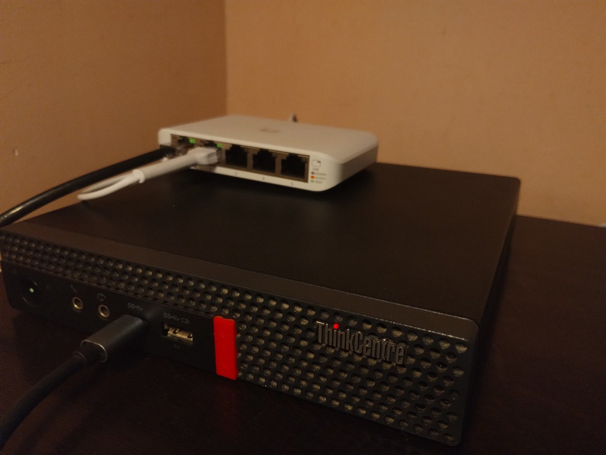

# homelab stacks 
> my personal home lab stacks and services. 🦉

## Table of Contents
- [About](#about)
- [Getting Started](#getting_started)
- [running services](#running_services)
- [TODO](#todo)

## About 
This is a collection of services I run on my home lab. I use a Raspberry Pi 3 B+ as my main server, and a VPS as a reverse tunnel server. I use the reverse tunnel to access my Raspberry Pi from anywhere in the world. I use a domain name to access my Raspberry Pi, and I use Cloudflare to manage DNS. I use Nginx as a reverse proxy, and I use Docker to manage my containers.

## Getting Started 
### prerequisites
- Raspberry Pi 3 B+
- VPS
- Domain name
- Cloudflare account

## Running Services 
- [sshm](services/sshm/readme.md)
- [encrypted-dns](docker/pi-hole/readme.md)
- [pi-hole](docker/pi-hole/readme.md)

this is what my home lab looks like: 

## TODO 
- [ ] add more services
- [ ] add more documentation

